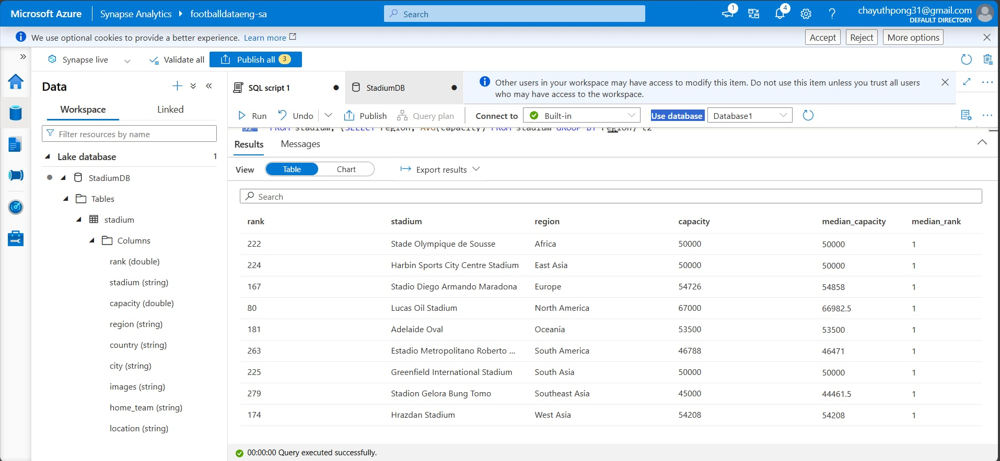

# Football-Data-Analytics

## Overview

This project centered on building a robust, cloud-native ETL pipeline for comprehensive analysis of Football Stadium data. The workflow was managed by Apache Airflow, orchestrating the extraction of data from Wikipedia and its initial loading into a Raw Storage Layer (Azure Data Lake Gen2). Azure Data Factory (ADF) was implemented to execute the core transformation logic, cleansing and restructuring the data before loading it into a final Transformed Data Lake bucket and Azure Synapse Analytics for scalable querying. The project culminated in the creation of an interactive dashboard using Tableau, providing a clear visual interface for statistical analysis and actionable findings.

## Table of Contents
- [Overview](#overview)
- [Architecture](#architecture)
- [Dataset Used](#dataset-used)
- [Step in This Project](#step-in-this-project)
- [Results](#results)

## Architecture

### Tech Stacks
1. Programming Language - Python
2. Workflow Orchestration - Apache Airflow
3. Microsoft Azure
    1. Azure Data Lake Gen 2
    2. Azure Data Factory
    3. Azure Synapse Analytics
4. Data Visualization - Tableau

## Dataset Used
List of association football stadiums by capacity

The following is a list of football stadiums. They are ordered by their seating capacity, that is the maximum number of spectators that the stadium can accommodate in seated areas. Football stadiums with a capacity of 40,000 or more are included. That is the minimum capacity required for a stadium to host FIFA World Cup finals matches. Note that most sports venues with a capacity of at least 40,000 are used for association football. The list contains both stadiums used solely for football, and those used for other sports as well as football. Some stadiums are only used by a team for certain high attendance matches, like local derbies or cup games.

More info about dataset - https://en.wikipedia.org/wiki/List_of_association_football_stadiums_by_capacity

## Step in This Project
1. Fetch data from wikipedia.
2. Clean ,transform and load data into Azure Data Lake Gen 2 using Apache Airflow for workflow orchestration.
3. Transformed and load data from raw bucket to transformed bucket using Data Factory.
4. Load and In-depth Analysis data using Azure Synapse Analytics.
5. Create Dashboard.

## Results
1. Run Apache Airflow dag

2. Data loaded into Data Lake Gen2

3. Data Factory pipeline

4. Data loaded into Azure Synapse Analytics

5. In-depth Analysis
    1. Average Capacity of the stadiums by region
    
    2. Count the number of stadiums in each country
    
    3. Stadium ranking with each region
    
    4. Top 3 stadium ranking with capacity
    
    5. Stadium with capacity above the average
    
    6. Stadiums with closes capacity to regional median
    
6. Create Dashboard
